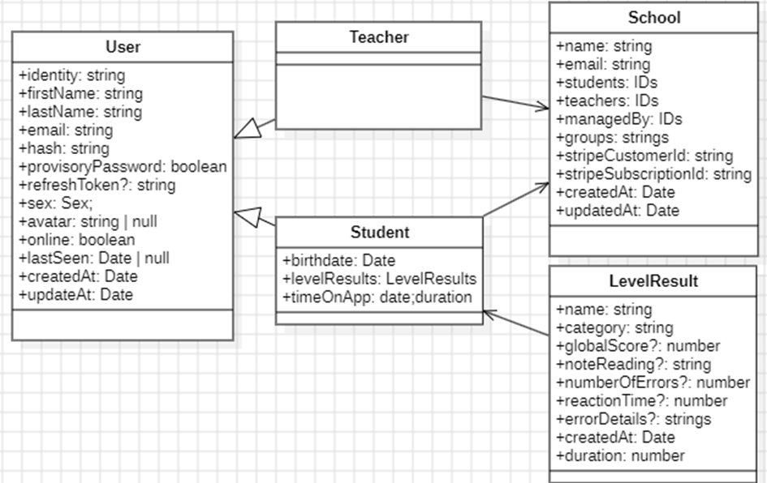

# Solfège Backend API

A backend API built with **Node.js**, **TypeScript**, **Express**, and **WebSocket**, using **MongoDB** as the database.

## Getting Started

### 1. Install dependencies

```bash
npm install
```

### 2. Run the development server

```bash
npm run dev
```

## Tools

- **Language:** TypeScript
- **Framework:** Express.js
- **Database:** MongoDB (via Mongoose)
- **WebSocket:** Socket.IO
- **Validation:** Joi
- **API Docs:** Swagger (OpenAPI)

---

## Database Overview



---

## API Documentation

After starting the server, the terminal will display a local Swagger URL (e.g., `http://localhost:3000/api/docs`).  
You can use it to quickly explore all available endpoints and understand how to interact with the API.
